# CoinPilot

CoinPilot is a production-oriented Expo + React Native + TypeScript crypto tracker focused on public CoinPaprika endpoints. The app ships a dark fintech UI with market overview cards, trending assets, market search, coin detail screens, a locally persisted watchlist, and a manual portfolio calculator with no backend.

## Stack

- Expo SDK 54
- TypeScript
- Expo Router
- Zustand
- TanStack Query with AsyncStorage persistence
- FlashList
- React Native Gifted Charts
- Jest + React Native Testing Library

## Features

- Market overview with total market cap, 24h volume, BTC dominance, and active coin count
- Trending assets section from the public trending feed
- Search by coin name or symbol with ranked live results
- Coin detail screen with price, market cap, 24h volume, 24h move, 7D chart, and summary text
- Local watchlist persisted with Zustand + AsyncStorage
- Local portfolio tracker with manual quantity and optional average cost basis
- Offline access to last-successful market queries through persisted TanStack Query cache
- Rate-limit aware API messaging for public CoinPaprika usage

## Endpoint Decisions

Only public-accessible CoinPaprika endpoints are used:

- `GET /global`
  Used for market overview summary cards.
- `GET /tickers`
  Used for ranked market lists and trending proxies.
- `GET /search?c=currencies`
  Used for market search and portfolio add-holding lookup.
- `GET /tickers/{id}`
  Used for watchlist snapshots and lightweight portfolio valuation updates.
- `GET /coins/{id}`
  Used for coin detail metadata and summary text.
- `GET /coins/{id}/ohlcv/historical` (with `/ohlcv/latest` fallback)
  Used for chart data on the coin detail page.
- `GET /global`
  Used in settings as a public API health check probe.

## Architecture

Routes:

- `app/(tabs)/market.tsx`
- `app/(tabs)/watchlist.tsx`
- `app/(tabs)/portfolio.tsx`
- `app/(tabs)/settings.tsx`
- `app/coin/[id].tsx`

Core structure:

- `src/api`
  Typed CoinPaprika responses, centralized query keys, client, id resolvers, and raw-to-UI mappers.
- `src/features/market`
  Market queries, search/sort/filter logic, market screen, and coin detail screen.
- `src/features/watchlist`
  Persisted watchlist store, watchlist query hook, and watchlist screen.
- `src/features/portfolio`
  Persisted holdings store, valuation math, portfolio pricing query, and portfolio screen.
- `src/features/settings`
  Settings store, haptics/cache actions, health query, and settings screen.
- `src/components`
  Reusable UI primitives such as `PriceBadge`, `PercentagePill`, `CoinRow`, `LoadingSkeleton`, and `EmptyState`.
- `src/providers`
  App-wide providers including query persistence and navigation theme wiring.

Data flow:

1. Screen hooks call typed CoinPaprika query functions.
2. Raw endpoint payloads are mapped into stable UI models.
3. Zustand persists user-owned local state like watchlist, portfolio, and settings.
4. TanStack Query persists network cache so last-successful market data is available after relaunch or while offline.

## Edge-Case Handling

- Rate limits:
  Public API `429` responses are normalized into a clear warning message.
- Missing sparkline data:
  Coin detail falls back to an empty-state card instead of failing the screen.
- Missing/null fields:
  All monetary and quantity formatting helpers return `N/A` safely.
- Empty watchlist:
  The watchlist screen shows a dedicated empty state.
- Search with no matches:
  The market screen shows a search-specific empty state.
- Offline cache:
  Persisted query cache restores last-successful market responses.
- Currency formatting:
  Helpers handle compact values, tiny decimals, nulls, and sign formatting consistently.

## Testing

Implemented coverage includes:

- Price and quantity format helpers
- Watchlist persistence behavior
- Portfolio valuation math and weighted-cost merge logic
- API mapper transformations
- Market search ranking and sort/filter logic
- A small component render test with React Native Testing Library

Run tests:

```bash
npm test
```

Run typecheck:

```bash
npm run typecheck
```

## Local Development

Install dependencies:

```bash
npm install
```

Run the app:

```bash
npm run android
```

Or:

```bash
npm run start
```

## APK Generation

APK: https://expo.dev/accounts/druidivine/projects/coinpilot/builds/4b9d170b-e269-42a3-bf97-0d324c259673

Build an Android APK with EAS:

1. Install the Expo/EAS tooling if needed:

```bash
npm install -g eas-cli
```

2. Log in and configure the project:

```bash
eas login
eas build:configure
```

3. Trigger an Android preview build that outputs an installable APK:

```bash
eas build --platform android --profile preview
```

4. Download the generated artifact from the EAS build page.

If you need a local debug build instead of EAS cloud output, generate native Android files first and then use Android Studio or Gradle:

```bash
npx expo prebuild -p android
```

## Screenshot Checklist

       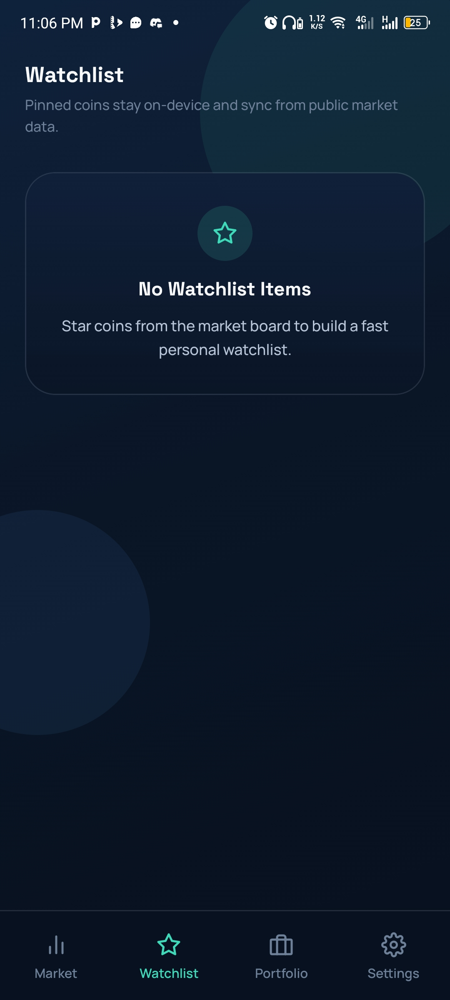   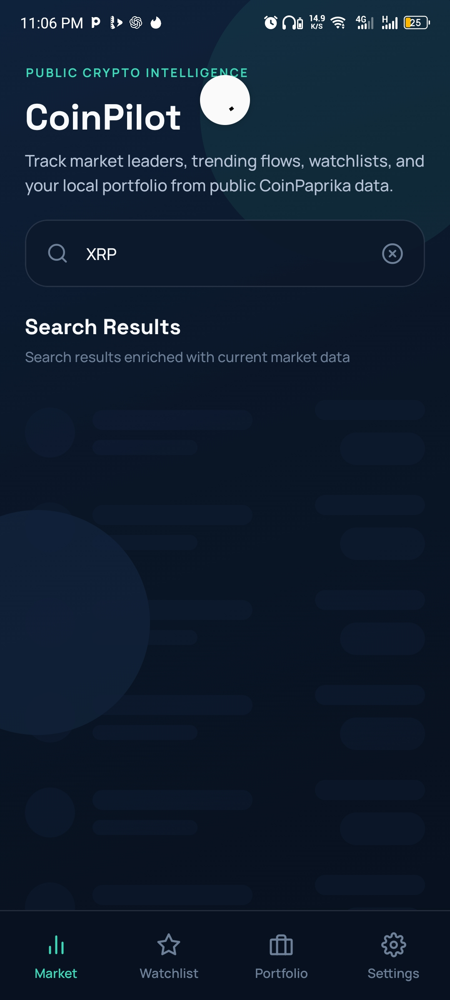 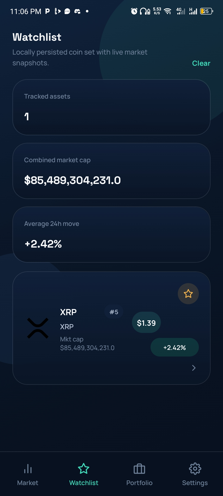  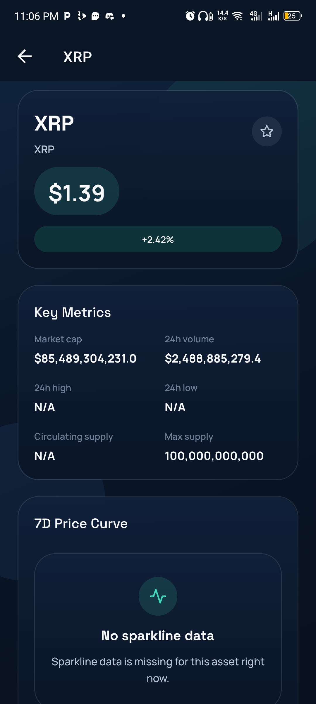 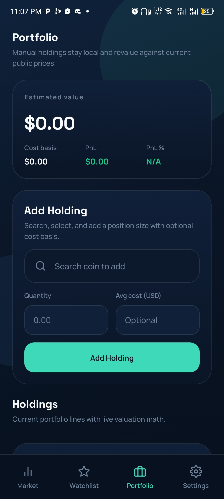 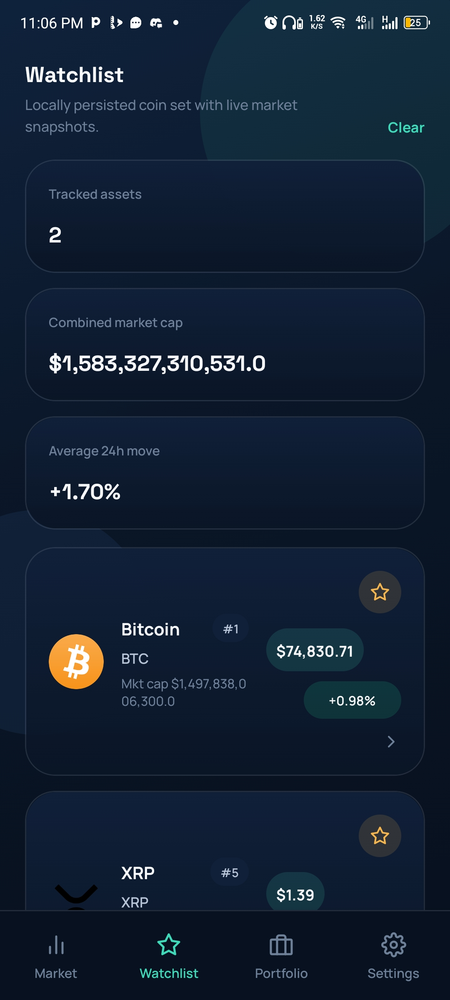 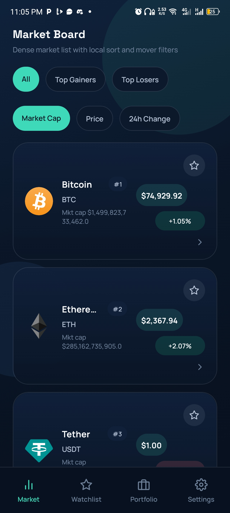 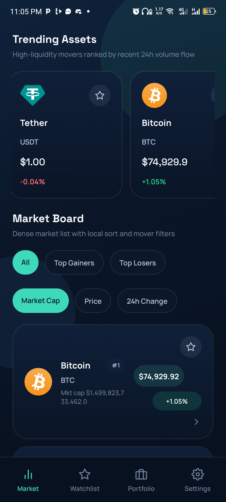 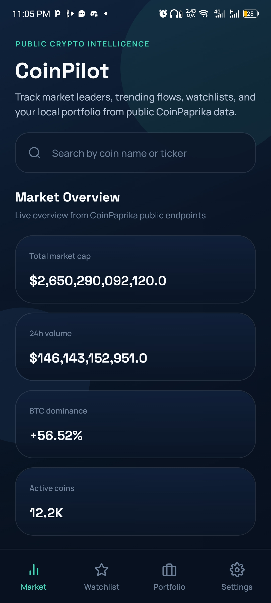 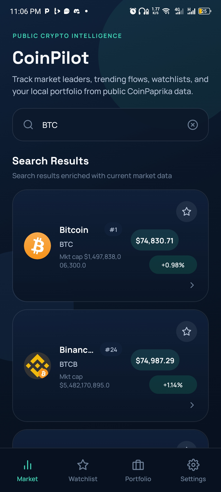 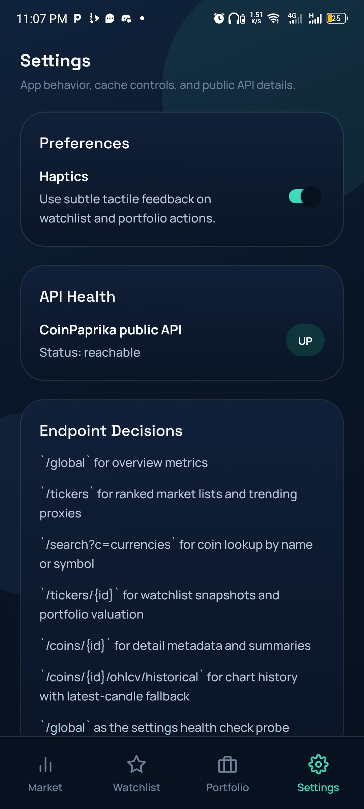   


